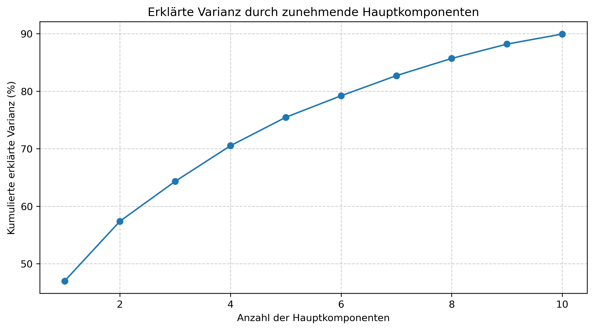
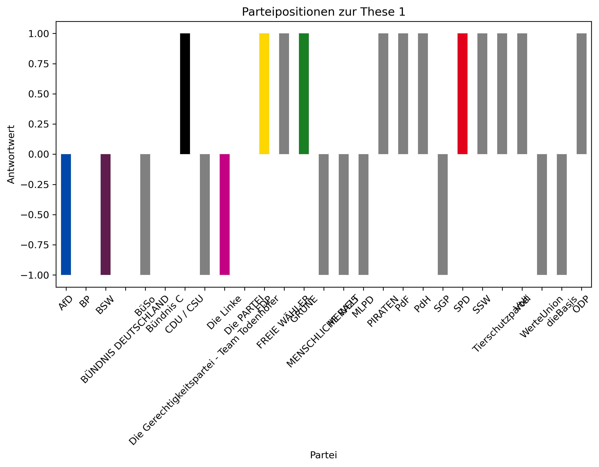
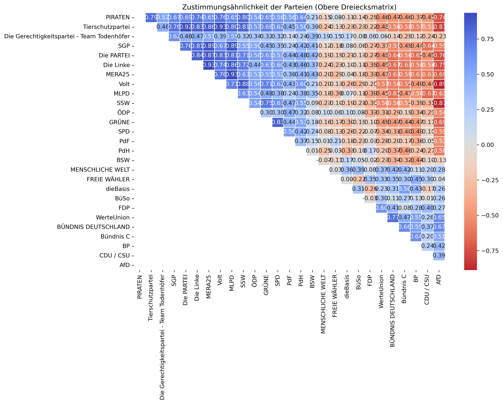

# WahloMat 2025 – Analyse der Parteipositionen

## Clustering der Parteien nach Positionen

## 3D Clustering der Parteien

## PCA Erklärte Varianz

## Parteipositionen zur gewählten These

## Verteilung der Parteipositionen

## WahloMat 2025 – Jupyter Notebook Analyse

## Wahl-O-Mat Bundestagswahl 2025 Daten
📂 **Dataset:** [Wahl-O-Mat_Bundestagswahl_2025.zip](Wahl-O-Mat_Bundestagswahl_2025.zip)

## Zustimmungsähnlichkeit zwischen Parteien

