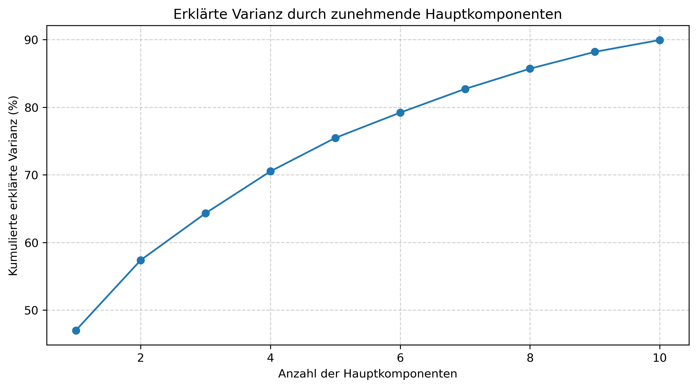

# WahloMat 2025 – Analyse der Parteipositionen

## Clustering der Parteien nach Positionen

## 3D Clustering der Parteien

## PCA Erklärte Varianz

## Verteilung der Parteipositionen

## Weitere Analysen von WahloMat Daten
🖼️ Repo von [microraptor](https://github.com/microraptor/wahlomat_analysis) = weitere Analysen, inkl barcharts für Thesen auf die Hauptkomponenten und Analysen älterer Wahlen
❓ [Reddit-Discussion](https://www.reddit.com/r/de/comments/1ijw36w/politische_%C3%A4hnlichkeit_von_parteien_nach/)

## WahloMat 2025 – Jupyter Notebook Analyse
🖥️ [Wahlomat 2025](Wahlomat%202025.ipynb)

## Wahl-O-Mat Bundestagswahl 2025 Daten
📂 **Dataset:** [www.bpb.de](https://www.bpb.de/)

## Zustimmungsähnlichkeit zwischen Parteien

